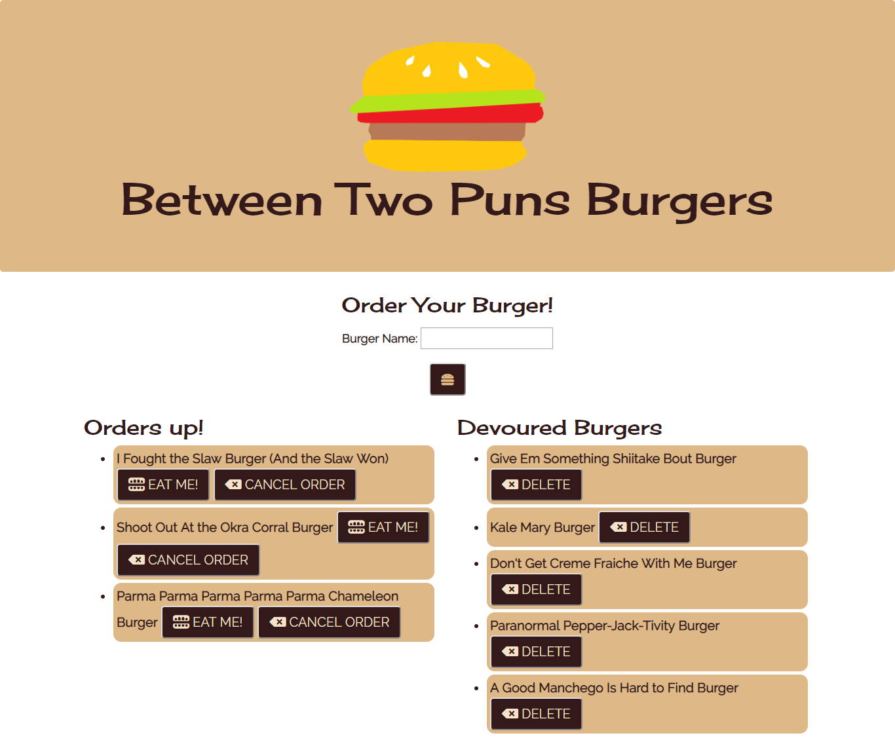

# kale-mary-burger

This is a burger ordering app, using MySQL, Node, Express, Handlebars and a homemade ORM. The MVC design pattern is used, and Node and MySQL are used to query and route data in the app.  Handlebars generates the HTML.

## Authors ⌨️

* **Genevieve DePriest** - [gdepriest](https://github.com/gdepriest)